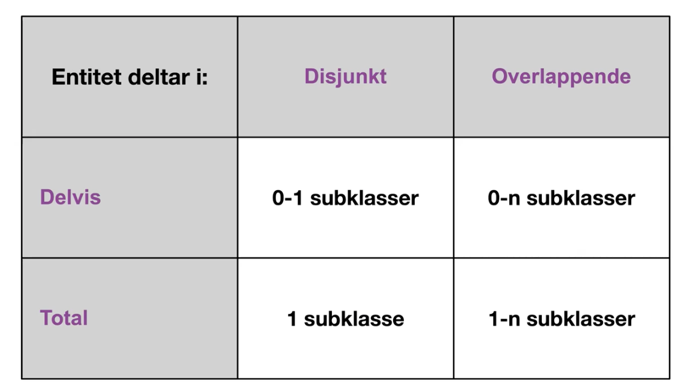

# Video 1: Video-1-intro-ER-modellering

## Database
* Databasen er en modell av en del av virkeligheten

## Miniverden
* Miniverden er den relevante delen av virkeligheten 
* Miniverden gir oss
  * Relevante data(-objekter)
  * Relevante sammenhenger mellom objekter
  * Rlevante regler som gjelder 
## ER, Entity-Relationship-modeller
* ER-modeller er en konseptuell datamodell
* Datastruktur
  * Entiteter (objekter) og relasjoner mellom entiteter
  * Entitetsklasser og relasjonsklasser 
  * Attributter
* Restriksjoner (constraints)
  * Nøkkelrestriksjoner
  * Datatyper for attributter
  * Struktuelle restirksjoner

## Entiteter
* Entiteter er objekter eller "noe" som eksisterer i miniverden
* Beskriver egenskaper ved entiteter ved hjelp av attributter

## Attributter
* Attributter henter sine mulige verdier fra et domene (datatype)
* Ulike attributter
  * Enklie, sammensatte
  * En eller flere verdier 
  * Avledet (ved hjelp av en regel)
  * Nøkkelattributter (entydige identifikatorer)

## Entitetsklasse /entitetstype
* Mengden av alle likartede entiteter som er av samme klasse (type) og har samme egenskaper 
* Alle entitetsklasser må ha en unik identifikator (nøkkel)
* Datatyper tas vanligvis ikke med i diagrammer
* Understreker identifikator (nøkkel)

## Relasjoner
* Relasjoner er sammenhengen (assosiasjonen) mellom to eller flere entiteter 
* Modellerer informasjon som viser en sammenheng mellom to eller flere entiteter:
  * En student har tatt eksamen i et emne
  * En person eier en bil
* Relasjoner kan ha egenskaper på samme måte som entiteter, altså egne attributter
  * Karakteren som en student fikk på eksamen i emna
* Relasjone eksisterer ikke uten de enitetne som deltar
  * Sletter vi et emne, må alle relasjoner til emne og slettes
* Relasjonens grad (degree) er antall eniteter som inngår
* Relasjonsklasser (-typer) er mengden av likeartede relasjoner mellom samme entitetsklasser

### Kardinalitetsforhold
* Kardinalitetsforhold begrenser hvor mange entiteter en entitet kan ha samme relasjon til 
* Samme type diagram man burker for en-til-mange osv.

### Eksistens (partial/total participation)
* Partial og total participation vises med henholdvis enkel eller dobbelt strek, hvor parital ikke gir noe krav, men
total sier at det må være en relasjon denne veien. (eksistens restriksjoner)
* Man kan spesifisere kardinalitets- og eksistens-restriksjoner i et min-maks-par 

## Trinn i utvikling av datamodeller
1. Finn de nødvendige entitetsklassene
2. Finn attributter for enitetsklassene
3. Finn de nødvendige relasjonsklassene 
4. Finn attributter for relasjonsklassene
5. Bestem nøkler for enitetsklassene 
6. Bestem restriksjoner for relasjonsklassene 
7. Vurder om du har en god modell, gjør evt. nødvendige endringer

> ## Oppsummering
> En ER-modell er en konseptuell datamodell, som viser sammenhengen mellom entiteter. Denne sammenhengen er basert på 
> en miniverden (som er den relevante delen av virkeligheten for ER-modellen). Entiteter (beskrevet av attributter) er
> objekter. Disse objektene er knyttet til hverandre gjennom relasjoner. Hvis det er krav på hvor mange relasjoner 
> entiter kan ha til hverandre bestemmes dette av kardinalitetsforholdene og/eller eksisten (partial/total partivipation).

# Video 2 Rekursive relasjonsklasser: Video-2-ER-rekursive-relasjonsklasser
* Realsjonsklasser der samme entitetsklasse deltar flere gange
* EN entitetsklasse kan ha flere roller i relasjonsklassen

> ## Oppsummering
> En rekursiv relasjonklase er en klasse som har relasjoner i begge retninger.
> 

# Video 3 Svake entitetsklasser: Video-3-ER-svake-entitetsklasser
* En entitetsklasse er en mengde entiteter 
  * Vi kan altså ikke ha to like eniteter i en entitetsklase
  * Alle enitetsklasser må ha en unik identifikator 
* En entitetsklasse som mangler en "naturlig" nøkkel, kan av og til identifiseres gjennom en **identifiserende 
relasjonsklasse** til en annen (identifiserende) entitetklasse
* Dette kalles en svak entitetsklasse (siden den mangler nøkkel)
  * Den må være eksistensavhengi av deltakelse i den identifiserende relasjonsklassen
  * Den må ha ett eller flere attributt som identifiserer entiteter unikt sammen med en nøkkel til den identifiserende 
  entitetsklassen
* Fordelen er at vi unngår å legge til et "unødvendig" nøkkelattributt (som betyr mye arbeid)
* Svake identitesklasser og identifiserende relasjonsklasse har dobbelt boks

> ## Oppsummering
> Svake entitetsklasser brukes når det ikke er noen naturlig nøkkelattributt hos entitesklassen. Sammen med
> relasjonsklassen (1,1), danner et "halvnøkkel-attributt" og relasjonsklassen tilsammen én nøkkel. 

# Video 4(5) EER spesialisering
* Standard ER, pluss
  * Støtte for spesialisering/generalisering
    * Subklasser/superklasser
  * Entitetsklasser med entiteter fra ulike entitetsklasser
    * Kategorier (union-typer)
  * Arving 
    * Relasjonsklasser og attributter
 
## Spesialisering / generalisering
* Spesialisering 
  * Å definere en mengde subklasser (underklasser) for en enitetsklasse
    * Idrettøvelser
      * Skiøvelser 
      * Friidrettsøvelser
        * Kas
        * Hopp
        * Løp
      * Balløvelser
  * Generalisering
    * Samling av en entitetsklasser med felles egenskaper som subklasser under en (felles) superklasse (overklasse)
  * De felles egenskapene modelleres på superklassen
  * Det som er unik for en subklasse, modellerers på sibklassen

### Notasjon 
* En entitit i en subklasse er alltid en enitet i superklassen
  * Man har en speuslell rolle
* Enitieter i subklasser:
  * Arver alle superklassenes attributter og relasjoner
* Subklassene kan ha enge
  * Attributter
  * Relasjoner
* Entiteter må ikke være med i en subklasse, men det kan være et krav
* En entitet kan være med i bare en subklasse, eller den kan være med i flere
 

### Restriksjoner
* Reglerbasert eller brukerstyrt deltakelse i subklasser
* Disjunkte eller overlappende subklasser
  * Disjunkt : D
    * En entitet kan bare være med i én subklasse
  * Overlappende: O
    * En enitet kan være med i flereundrklasser 
* Delvis eller total speisalisering (frivillig eller tvungen)
  * Delvis: enkelstrek
    * Kan være med i subklasse
  * Total: dobbelstrek
    * Må være med i subklasse

# Video 5 EER kategorier (Union typer)

## Kategorier: Subklasser med flere superklasser
* Mengden entiteter i en kategori er en delmangde av entiteter i superklassene
* Kategorier kalles også for union-klasser, der U i sirkelen 

## Notasjon
* U inni sirkelen  

## Kategorier: Restriksjoner, delvis/total
* Delvis - Alle objekter i klassen trenger ikke være  med i kategoriklassen
* Total - Alle objekter må vøre med i Kategoriern 

## Oppsummering 
* Hva er kategorier?
* 

