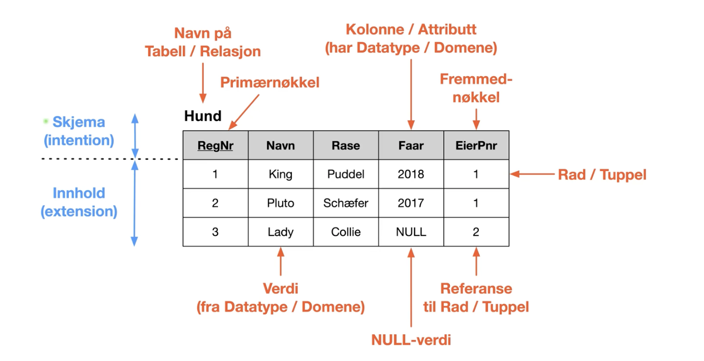

# Video 6 Relasjonsdatabaser intro
## Oversikt
* MYSQL
* SQL
* Modell
* Oversetting fra ER
* Relasjonsalgebra

## Modell 
### Relasjonsdatabaser (1): Tabeller/Relasjoner

 
### Relasjonsdatabaser (2)
* Skjema ("intention") beskriver tabellern
  * Tabellnavn
  * Kolonner (attributter)
  * Kollennes datatyper 
  * Restriksjoner
    * Primærnøkkel (entydig identifikator) og andre restriksjoner
  * Forekomst av data ("extentions")
    * Rader/tupler med lovlige verdier
  * Spesiell NULL-verdi
    * Der vi ikke har noen verdi ("ukjent eller manglende")
  * Fremmednøkkel
    * Verdi som viser til en rad (tuppel) i en annen tabell (ev. samme tabell)

### Relasjonsdatabaser (3)
* Standard relasjonsdatabaser har
  * Atomiske verdier i domenene (datatyper)
  * En verdi for hvert attributt (i en rad)
  * Dette gir oss "flate, 2-dimensjonale tabeller"
* Ikke-standard relasjonsdatabser kan ha 
  * Sammensatte attributter (poster, tabeller), repeterende grupper (fler-verdi-attributter)
* Entitetsintegritet
  * En ralsjon (tabell) er en mengde tuppler (rader):
    * Kan ikke ha to like tuppler (rader)
  * Alle tabeller må ha en primærnøkkel (unik identifikator)
    * For å sikre at primærnøkkelen har unike verdier tillates ikke NULL.verdier i pirmærnøkkel (som kan bestå av flere attributter)
* Referanseintegritet
  * Fremmednøkler må referere til et tuppel (rad) som finnes i den tabellen det refereres til eller bare bestå av NULL-verdi(er)

# Video 7 Relasjondatabaser mapping av ER
## ER -> RDB (1), Regulære entitetsklasser

* Entitetsklasser får en egen tabell
  * Enkle attributter som i ER-modellen
  * Sammensatte attributter splittes opp
  * Primærnøkkel som i ER-modell

## ER -> RDB (3), Svake entitetsklasser
_

* Vi legger til primærnøkkel fra identifiserende entitetsklasser som utgjør pimærnøkkel for den svake klassen sammen med klassens delvise nøkkel
* Primærnøkkel fra identifiserende entitetsklasser er fremmednøkkel mot tabellen for "egen klasse"
* Legg merke til at:
  * Det er som for en regulær entitetklasse, unntatt håndteringen av ormærnøkkel

## ER -> RDB (3), Binære entitetsklasser

* Legger til en fremmednøkkel i en av tabellene eller lagreer en egen koblingstabell
* Velger ofte den løsningen som gir minst NULL-verdier

ca. 10/13