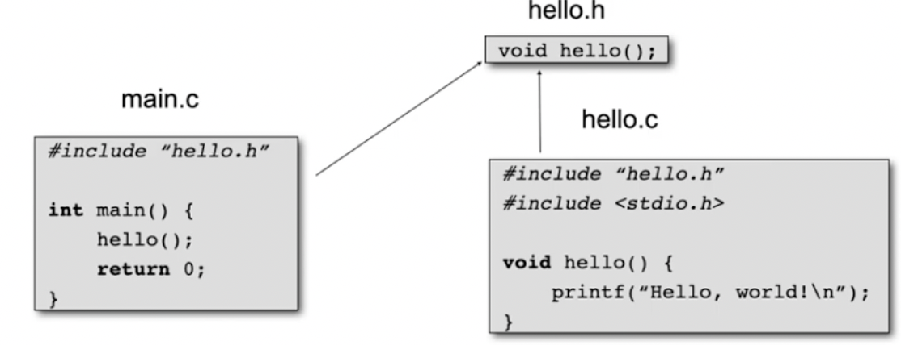
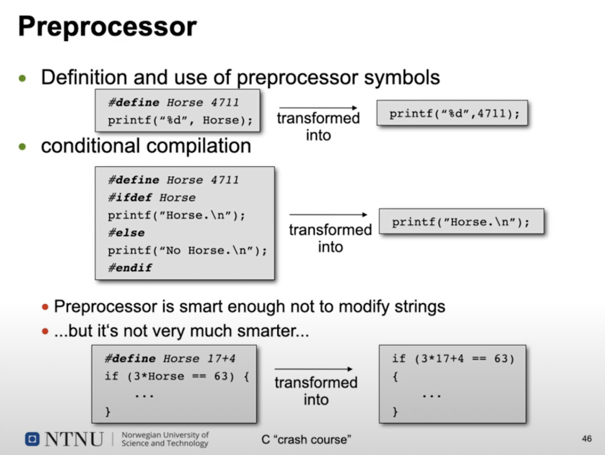
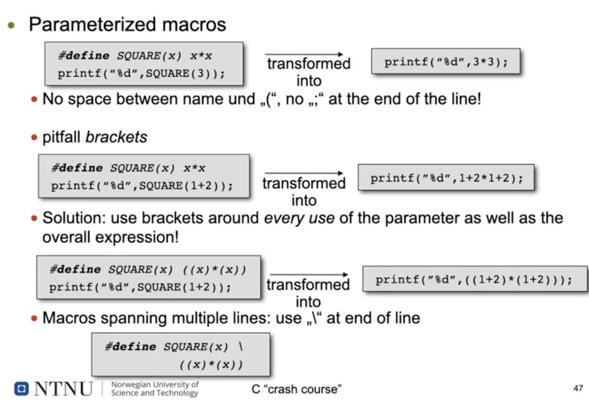
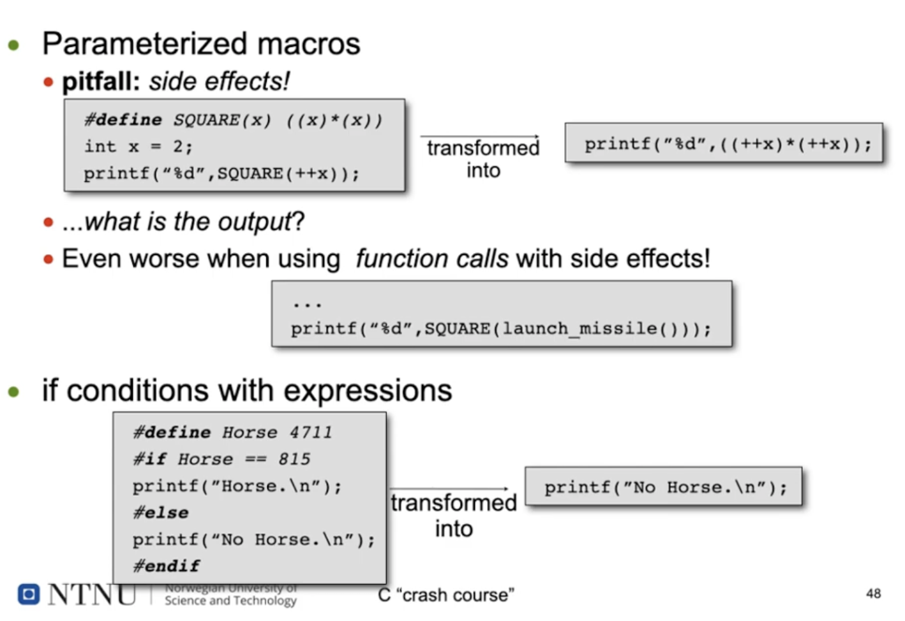

markdown

# 10.01.22 C "crash course" pt.1 

## Output using printf
* Make printf "known" to the compiler:
```        java
#include <stdio.h>
``` 
* If you include placeholders in the string you print, you can add 
the variables at det end seperated by ','.
```    java
printf("A number: %d\nNow in hexadecimal: %x", -815, eastwood);
```
* decimal(signed): %d (unsigned: %u)
* hexadecimal: %x
* many more listed in the printf man page (type "man printf")

## Functions
* "Classless methods"
* Elementary buiding blocks which enable modularized imperative programs 
  * Functions reduce the complexity by partitioning complex problems into manageable parts
  * Reusable program components 
  * Hiding of implementations details 
* Functions vs. methods
  * Functions are declared and defines in the global scope
  * ...are not part of a class
  * ...do not provide .this
* Functions should be declared before they are used (called)

``` java
void bar(int);          /* declaration */

void foo(int b) {
    if (b<0) return;
    bar(b-1);
 }
 
 void bar(int a) {          /* definiton */
    if(a<0) return;
    foo(a-1)
 }
```
* Forward declaration tells the compiler that bar exists when it compiles foo
  * Otherwise, the comjpiler assumes that bar's return value is of the type int (implicit declaration)
  and disables type checking of parameters -> bad style, causes compiler warning
  
### Functions - Swapping Variable contents 
```java
#include <stdio.h>

foo (int a){
    a++;
 }
 
int main(){                         
    int a=5;                   /* declairs a local variable a */
    foo(a);                    /* calls foo with a = 5, but a in foo is not the same variable as a in main()*/
    printf("%d", a);           /* prints a (the local variable in main() whivh still is 5 */
    return 0
 }
```
* Java
  * Simple data types: call by value
  * Object types: call by reference 
* C
  * (technically) only call by value
  * (call by reference is possible by using pointers)
   
## Control structures 
* In C: same as in Java 
  * if (condition) {...} else {}
  * while (condition) {...}
  * do{...} while (condition);
  * for(...;condition;...){case...:...}
  * continue; break;
* Only difference:
  * condition is integer number (not boolean)

## Standard Types
* Simple data types (similar to Java)
  * char 
  * int
  * float
  * double
  * void
* Additional modifiers
  * signed/unsignes
  * short/long
* Type boolean
  * Boolean expressions evaluate to 0 /false or 1 (true)
  * Integers can be used in place of boolean variables 
               
## Structures 
* There are no classes in C
* However, there are complex data types (structs)
  * "classes without methods"

```java
struct student {
    int student_id;
    int age;
    char name[64];
 };

void rejuvenate(struct student s){
    s.age = 0;
        }

void foo(){
    sruct student s1;
    s1.age = 20;
    rejuvenate(s1);
        }
```

## Operators 
* Access to members of an object 
  * Access to methods or member variable of en obcjet in Java
  * C does not provide objects with related methods 
* (t) cast to type t 
  * Automatically checked for validity in Java
  * in C: value in memory gets interpreted as Type t
* & address operator 
  * Returns the address of a variable in memory 

## Variables 
* Always have to be initialized (as in Java)
  * Otherwise, their value is undefined 
  * Initialization can be combined with declaration
* Can have global or local scope 

### Global variables 
* Defined outside of functions 
* Accessible in the program below the line of their definition 
* Can be overlayed by local variables 

* Problems 
  * Missing context: relation between data objects and ccoe using these objects is not visible
  * Functions can change variables at any time without the function's caller noticing iot
  * More difficult program maintenance
* **Avoid global variables whenever possible!

### Local Variables 
* Declared inside and at the start of a function or blocks 
* Are not accessible outside of that function or block
* Overlays (covers) all previous definitions of an object with the same name; these are not accessible inside of the block!


> Summary:
> 


# C crash course pt.2

## Pointer (variables)
* Variables have an address in memory
* The address can in turn be stores in another variable

```java
int eastwood = 4711;
int *p;
p = &eastwood             /* p "points" to "eastwood" now */
```

* Variable: name of a data object 
  * eastwood --> 4711
* Pointer variable (pointer):
  * name for a reference to a data object 

* A pointer variable (pointer) stored the address of another variable: it points to that variable 
* This addres enables indirect access to the varable 
* Commonly used in C code:
  * Functions can be enabled to modify their parameters (resp. the objects these parameters point to), this is the way
    to implement call by reference in C!
  * Dynamic memory allocation and management 
  * More efficient programs
* Disadvantages...
  * Program structure is less cleat (which function can access which variables?)
  * Most common source of errors in C programs

### Pointers - syntax 
* Syntax to creat a pointer variable:
  * Type *Name;

```java
int eastwood = 4711;
int *p;
int x;

p = &eastwood               /* p "points" to eastwood now */

x = *p;                     /* copies the object p points to into x */
```
* Address operator & 
  * &x returns the address of variable x
* Dereference operator *
  * *x enables access to the content of the variable x points to 

### Pointers - as Function Parameters
* Parameters are always passed by value in C (i.a., copied)
* A function can neer modify tha value of one of its parameters in the context of the calling function!
* Pointers are also passed by value 
  * function is passed a copy of the address
* Using this pointer copy, the function can access the associated variable using the *-operator ("dereference") and 
  change it this way:
  * Call by reference

````java
void inc(int *x){
        (*x)++;
        }

int main(void){
    int foobie = 42;
    inc (&foobie);              /* etter denne linjen vil foobie være 43, fordi vi har brukt pointer */
        }
````

* Altså kan man direkte endre på variabler ved å bruke pointers, hvis man ikke bruker pointers vil man ikke kunne endre
på en variabel som ikke er lokal til funksjonen du bruker. 

````java
void swap(int *a, int*b){
    int tmp = *a;
    *a = *b;
    *b = tmp;
        }
        
int main(void){
    int olerant = 42, ernational = 4711;
    swap (&olerant, &ernational);
    
    printf(/"%d %d\n", olerant, ernational);
    retun 0;
        }
````
* swap() takes addresses of two variables
* Use og *-operators to access the referenced variables 

### Pointers - to Structures 
* Analogous to "pointers to variables"
```java
#include <stdio.h>  

struct listelement{
    char ly;
    struct listelement *next;
  } a, b, c;

a.next = &b;
b.next = &c;
c.next = NULL;      

```
* NULL: "special" address value, here used to indicate list termination  

* Access to structure elements using pointer
* Well-known procedure:
  * *operator references the structure 
  * .operator used to access the element 
  * Operator precedence at work: we have to use brackets here!

```java
struct listelement{
    char ly;
    struct listelement *next;
  } a, *p;

p = &a;
      (*p).ly = 'a';
```
* indentical, but (syntactically) nicer:
  * -> operator

```java
p->ly = 'a';
```
* Also possible, but not as common
  * Pointers to pointer (to pointers to...)
* Pointers to functions
  * E.g. used to pass a function as a parameter to another function
  * Example: library function qsort takes a parameter which is a pointer to a comparison function to compare tuples of 
    elements

## Typedef
* Definition of a new name for an existing type
* Syntax: like variable declaration, put typedef in front:

```java
typedef int Length;     /* this line does not use any memory! */

Lendth len, max-length;
void set_length(Length 1){...}
```
* Abstraction: the actual type is hidden and can be exchanges easily (well-known exaples: pid_t; FILE)
* Documentation: simple names easier to read/understand than comple pointer to a structure

```java
typedef struct listelement *LEPtr;
LEPtr elem1, elem2;
LEPtr find_elem(LEPtr firstelem, int searchnum)
{...}

```

## Arrays 
* Similar to Java, but...
  * Dimensions can only be constants! 
  * Uninitialized global Arrays filled with 0s
  * Contents of uninitialized local arrays is undefined 
  * When using initializers, missing values at the end are filled with 0s

```java
int primes [100] = {2, 3, 5,7, 11, 13, 17};     /*primes [7] to primes[99] are set to 0! */

/* automatic dimensioning */
int even[]= {2,4, 6, 8, 10, 12};

```

* No bounds checjs when accessing arrays!
  * Effects when reading/writing outside of the array bound range from "nothing happens" to prigram crashes to completely
    undefined behavior!
* Real multi-dimensional arrays are also possible

### Multi-Dimesional Arrays 
* Definition and initialization 

```java
int calendar[12][31];                 /* 12 rows, 31 columns */
int lecture_limits[][5] =
        {{27, 27, 22, 27, 27},        /* odd weeks */
        {27, 27, 22, 27, 27}};        /* even weeks */ff

```                   
## Programs consisting of multiple files


                   
* #include is a preprocessor command
* preprocesor compies contents of header tilfe to its location in the file
* File paths in,"" are relative to the directory of the current .c file
* File paths in <> relate to compiler-defines and platfore-specific directories

## Modules
* For global variables we distinguish between
  * Variables only accessed from inside the module they are devlares in 
  * and ariables which are also accessed from other modules
* Access to global variables of other modules using **extern**
* **Static** makes global variables invisible to other modules 

* To access functions in other modules, **extern** is not required...
* Functions can also be declared **static**
  * Used for functions that should only be visible inside of a module
* Local variables can also be delared **static**
  * This has a completely different meaning!
  * Variable value "survives" between subsequent function calls

## Preprocessor 



 
## Arrays in memory
## Arrays and pointer
## Pointer Arithmetics 
## Strings 
