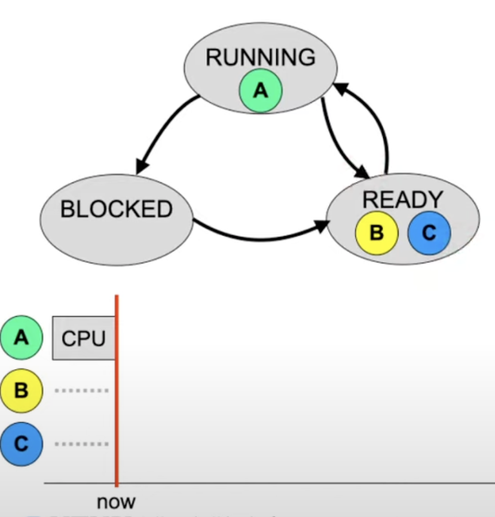
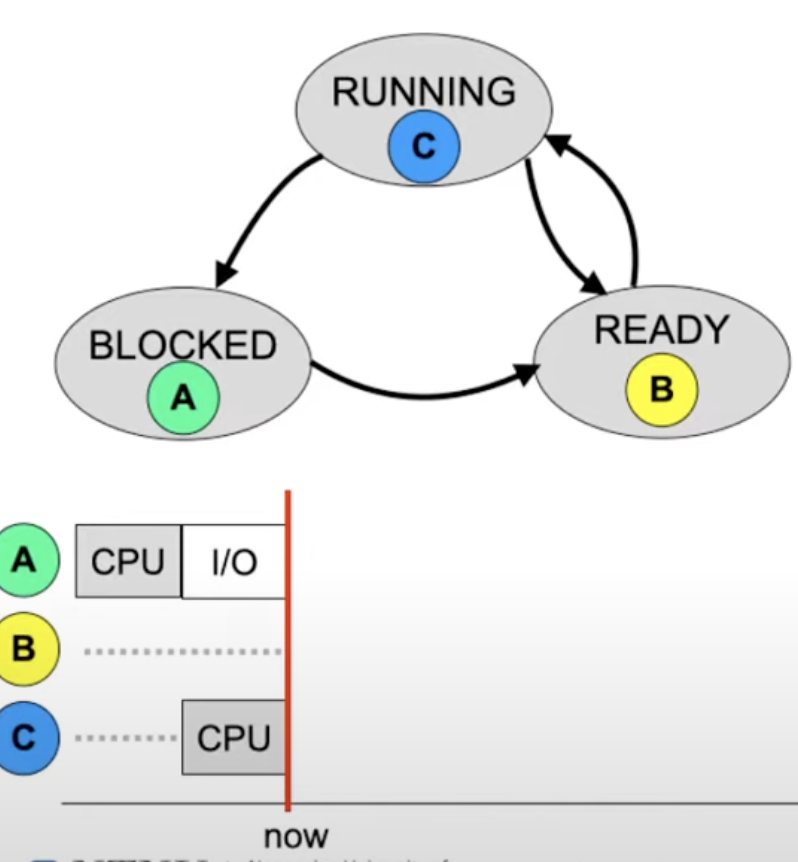
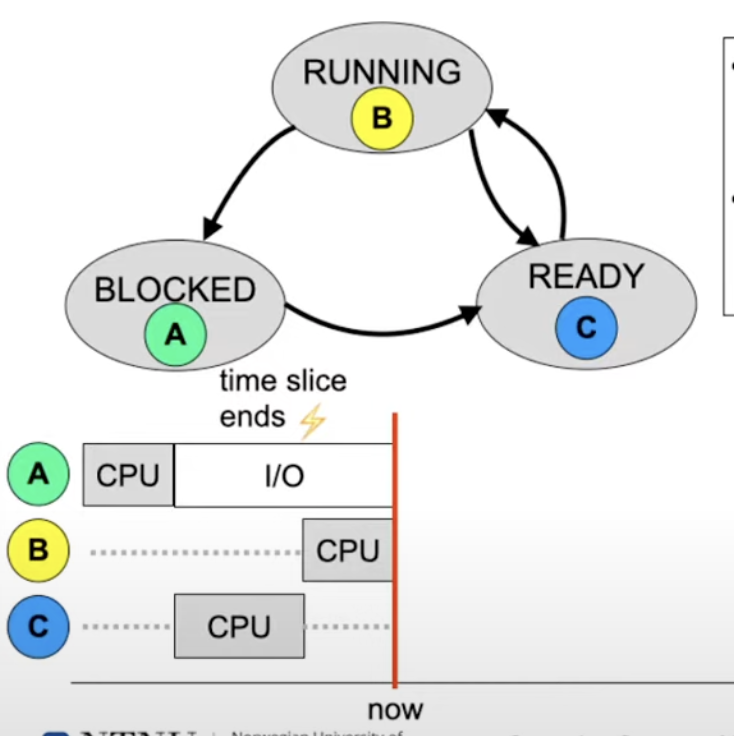
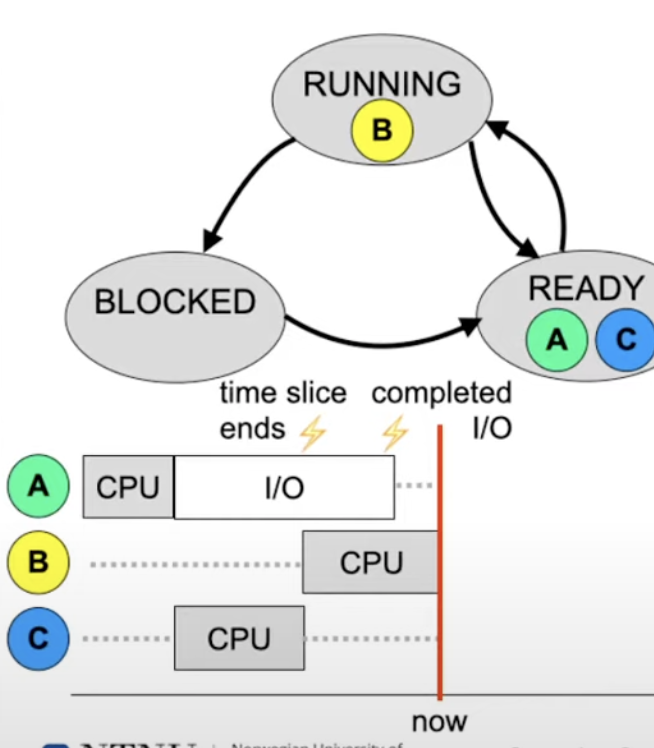
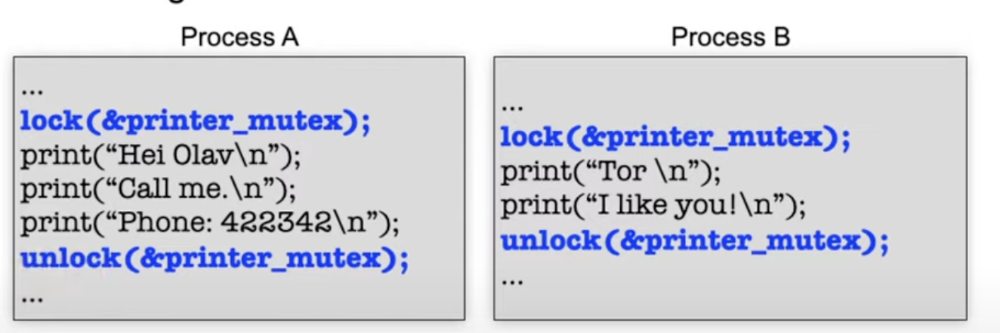

# Different views of an operating system
* Abstractions 
  * Process, virtual memory, file systems
* Tasks 
  * CPU scheduling, synchronization
  * Inter-process communication
  * Memory management
* Problems
  * Deadlocks
  * System security 
* Challenges
  * Multiprocessor systems
  * Cloud computing and virtualization

# A process
* ...is a program in execution
  * We differentiate between a program (thats the bits our compiler generate that are on the hard disk as executable file)
  * without starting the file nothing happens, the bits lie unchanged on the disk
  * Only when you start the program, you generate an instance of the program that has a runtime stat 
    * it is no longer static on the disk, but somthing that's changing
  * This is what we call a process

* This requires a process context (to give us more information , which consists of...
* Memory: code, data and stack segment (text, data, bss, stack, heap)
* Contents of processor registers 
  * Intruction pointer
  * Stack pointer
  * General purpose registers 
  * ...
* Process state 
* User ID (permissions)
* Access permission
* Currently used resources
  * Files, I/O devices, etc.

## The process model 
* Multiprogramming (technical view)
    * 1 instruction pointer
    * Context switching
* Concurrent processes (Conceptional view)
  * 4 independent sequential control flows
* CPU multiplexing (Real time view)
  * Only one process is active at any given point in the time

## Process behavior and states (1)
* A proicess can be in one of many states
* States:
  * Running
    * Process is currently being executed
  * Ready
    * Process is ready to run and waits for the CPU
  * Blocked
    * Process waits for the completion of an I/O operation

* Process A has started an I/O and was moved to the BLOCKED state
* Since A does not make use of the CPU now, the OS chose process C and moved it from READY to RUNNING
* This is a **context switch** from A to C

* Process C has used up its allocated CPU time and is **preemted**
* So, finally, process B is moved into Running and can be executed 

* The I/O opertaion of A is now completed 
* A is moved to READY and waits for the allocation of the CPU

# CPU scheduling
* A single scheduling algorithm is characterized by the order of processes in the queue and the conditions under which
the order of process in the queue and the conditions under which the process are added to the queue.
* Scheduling enables the coordination of concurrent processes 
* Basic questions:
  * which sort of events can cause preemption?
  * In which order should processes be executed?
* Objectives of a scheduling algorithm
  * User oriented -> short reaction times
  * System oriented -> optimal CPU utilisation
* No single scheduling algorithm can fulfill all requirements 

# Process synchronization
* Problem: If process A and B interfere with eachother 
* Reasons for the problem: critical sections 
* Solution approach: mutual exclusion 
  * using the mutex abstraction 

* If one of the processes A or B is in between the calls to lock and unlock, the other cannot pass the lock and blocks
at the lock until critical sections is left by the other process calling unlock 

* Deadlocks 

# Inter-process communication (IPC)
* ... enabled the collabortion of multiple processes 
  * Local, e.g. printing demon, X window server
  * remote, e.g. web server, database server, ftp server
    * client/server systems
* Abstraction/programming models
  * Shared memory 
    * Multiple processes can use the same memory area at the same time
    * additional synchronisation is required
  * Message passing
    * copy sematics: recipient receives a copy of the message
    * can be synchronous ar asynchronous 

# Memory management 
* Address mapping
  * Logical addresses tp physical addresses
  * Enables relocation of code & data
* Placement strategy
  * In which gap should memory for process D be reserved?
  * Can we compact the memory?
  * How ti minimize fragmentation?
* replavement strategy 
  * Which memory area can be swapped out?

# background storage 
* The operating system provides a logical view to applications and has to implement this efficiently 
* File systems enable permanent storage of large amount of data 

# Access matrix 
* Elements of the matrix
  * Subjects (persons/useres, processes)
  * Objects (data, devices, processes, memory,...)
  * Operations (read, write, delete, execute,...)

# Basic model: file/process attributes
* Properties related to a user
  * For which user is the process being executed?
  * Which user is the owner of a file?
  * Which permissions does the owner of a file five to him/herself and which permissions to other users?
* Permission of a process when accessing a file
  * Attributes of processes: user ID
  * Attributes of files: owner ID

# Unix access permissions
* Unix: simple access control lists 
* Processes have a user ID and a group ID
* Files have an owner and group 
* Permissions are related to the user 8owner), group, and all others

# NUMA architectures
* The CPUS (which can have multiple cores each) communicate via HyperTransport
* Global address space: Memory connected to a different CPU can be accessed but the latency is higher
* Approach enables better scalability since parallel memory accesses are possible

## CPU allocation for multiprocessors
* A single common READY list for all CPUs
* One READY list per CPU

# Cloud computing 
* According to the US national institute of standards and technology, a Cloud has five properties
1. Self-service on demand
2. High throughput network access
3. Resource pool
4. Fast adaptivity 
5. Measurable service

## Hardware virtualization
* ... enables the creation of multiple virtual machines on one physical computer. Each virutal machine has its own OS
* Important foundation technology for Cloud computing and server consolidation
* Technical basis: hypervisor/ virtual machine monitor 

# Conclusion: the OS...
* Administers resources, especially the CPUs and memory
* Provides abstraction, e.g....
  * the process concept 
  * files and directories
  * Permission concept 
* Is optimized for the specific application profile
* It is impossible to satisfy the requirements of all applications to 100%. We can approach this goal using virtualization
* Operating sysmtes, typical applications and hardware have evolved together during the last few decades. The system
abstraction available today are the result of an evolution which is till ongoing. 
