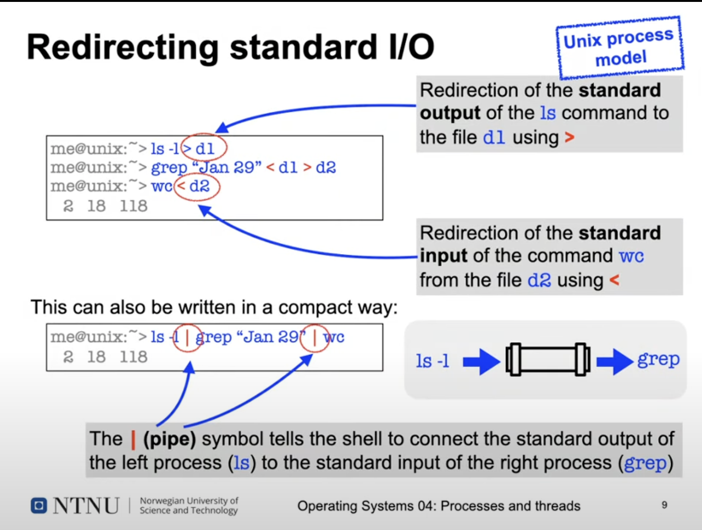

# Unix
* A system with a long history 
* Origin: AT&T Bell Labs 
  * Developed as an alternative to "Multics"
* Version 1 created on PDP 7
  * Written in assebler 
  * 8192 18 bit words of memory 
* Version 3 implemented in C on PDP11
  * C was created to enable OS development in a high-level language 

# Unix processes 
* Are the primary way to structure activities 
  * Application as well as system processes
* Can create new processes in a fast and easy way
  * Parent process -< child process
* Form a process hierarchy 
* The init process read a list og terminals from the file /etc/initlab and starts the program getty for each, which
enables to connect to  the terminal using login 
* Every Unix process has a unique number (process is, PID).
  * Ths PID of the parant process is called PPID
* The shell also uses processes: 
  * everu command is executed as a separate child process
* Init 
  * Is th very first process you see running
  * Responsible for starting up the rest of the system
  * It reads a list of so-called terminals from a special file and the filesystem called innittab 
  * For each of these terminals it starts a special process called getty
* Getty
  * Short for: get something from a tty (teletype)
  * Responsible for putting up a prompt 
    * This is the login process
    * It checks if a terminal is connected
    * And starts a shell (e.g. bash)

* When our kernel boots first creates a swapper 
* Swapper creates an init and pagedaemon (these run all the time)
  * init: responsible for starting all the gettys on the terminals 
  * Pagedaemon: responsible for managing swapping in and out of memory

# Unix shells
* A "shell" around the operating system "core"
* Text based user interface to start commands (unix programs) 
  * Commands can be located anywhere in the file system
  * Shell searches in directories given in the $PATH environment variable
* Every executed command is a separate child process
* Typically, the shell blocks (waits) until the last commands has terminated 
* It is possible to suspend, contiune and terminate commands (job control) and to have commands executing in the background

## Unix shell: job control
* Which 
  * Started, the shell blocks 
* Ctrl+z
  * Command is suspended
  * The shell continues to run 
* &
  * At the end of the input tells the shell to start and run the command in the background 
* Jobs
  * Gives a list of all started commands
* bg % listID
  * Sends a suspended command to the background 

# Standard I/O channels 
* Usually connected to the terminal in which the shell runs that started the process:
  * Standard input (stdin): reads user input (Keyboard)
  * Standard output (stdout): text output of the process (terminal window)
  * Standerd error (stderr): seperate channel for error messages (usually also connected to the terminal)
* Almost all Unix commands also accept files as input or output channels (instead of the terminal)
* Shells provide a simple syntax redirect the standars I/O channels 

## Redirecting standard I/O 
* Redirect the standard output to a command using >
* Redirect the standard input to a command  using <


# Process - OS interaction in Unix
* How does an application program request a service from the operating system?
* From the point of view of the application, calling an operation system service looks like a regular function call
* However, arbitrarily calling code inside the OS kernel is dangerlus:
  * No checking for correct parameters
    * -> Security nightmare
* The translation from code executing in an application to code running in the kernel needs to be protected
* The transition from code executing in an application to code running in the kernel needs to be protected
* Many CPUs provide several execution modes
  * User mode: only restricted functionality is allowed 
  * kernel/supervisor mode: full access to all hardware resources 
* Special machine instructions are provided to transition from user kernel mode;
  * int 0x80 (intel x86), syscall/sysenter (intel/AMG64)
  * trap (Motorola 68k), SVC (ARM), ECALL (RISC-V)
* Executing such an instruction causes the CPU to change its current execution mode to kernel mode and jump to an address
predetermined byt the processor hardware: system call
* Applications can execute a syscall intruction directly, but:
  * This stops working when the syscall interface changes 
* In most modern systems, the C library (libc) provides stubs (adapter functions) that call the actuall syscall
  * The stud function is a regualr function linked to the opplication

# Unix process control: syscalls
* A forst overview of process related system calls (syscalls):
  * getpid(2) - return PID of the calling process
  * getppid (2) - return PID of the parent process (PPID)
  * getuid (") - returns the UID of the calling process
  * fork (2) - creates a new child process
  * exit (3), _exit (2) - terminates the calling process
  * wait (2) - waits for the termination of a child process
  * execve(2) - loads and starts a program in the context of the calling process
* The number in the brackets give the section of the Unix manual pages the command is described in, read them e.g. with 
man 2 wait.

## Unix process in detail: fork()
System call: pid_t fork (void)
* Duplicated the calling process
  * Standard way ti create new processes in Unix
* The chil process inherits...
  * Address space (code, data, bss, stack, segments)
  * User and group ID
  * Standard I/O channels
  * Process group, signal table (more on this later)
* Not copied are the following...
  * Process ID (PID), parent process ID (PPID)
  * Pending signals, accounting data, ...
* One process calls fork, but two processes return!

### USe of fork()
 ````java
 int main () {
 i  int pid:
 printf("In parent: pid %d PPID %d\n", getpid(), getppid());  // Prints the pid and ppid to the process
 pid = fork();                                                // Creates a child process, and returns a pid 
 
if (pis > 0)      
    printf("In the parent process, child PID %d/n", pid);
else if (pid == 0)                                             // 0 indicated that we are in the child process 
    printf("In the child process, PID %d PPID %d\n", getpid(), getppid());
else
    printf("Oh, an error! \n");                                 

````

### Discussion: fast process creation 
* Copying the address spae takes a lot of time
  * Especially if the program immediately calls exec..() afterwards
    * complete waste of time!
* Historic solution: vfork
  * The parent process is suspended until the child process calls exec..() or terminates using _exit()
* The child simply uses code and data of its parent (without copying!) 
  * The child process must not change any data
  * Sometimes not so simple: e.g. don't call exit(), but _exit()!
* Modern solution: copy on write 
  * Parent and child process share the same code and data segments using the memory manegement unit (MMU)
  * A segment is copien only if the child process changes any data
  * This is not the case when exec..() is calles directly after fork()
  * fork() using copy on write is almoste as fast as vfork()

* The difference between fork() and vfork() is that
  * When fork is called, it creates a new process (child process), when this is created, both parent and child process
  start start their execution from the next statement after fork(), and both processes get executed simultaneously 
  * Vfork() is also a system call that creates a new process
    * The code of child is same as parent 
    * Here both processes share the same address space, therefore child process runs first, then parent

## Unix processes in detail: _exit()
System call: void_exit(int)
* Terminates the calling process and passes the integer argument as "exit status" to the parent process
  * This call does not return!
* Releases the resources allocated bt the process
  * open files, used memory,...
* Sends a signal SIGCHLD to its parent process
* There is also a library function exit(3) which additionally releases resources used by the C library 
  * Among other things, this outputs (flushes) all data still stored in output buffers!
* Normal process should use exit(3), not _exit

### Duscussion:  prhaned process
* A Unix process is orphaned when its parent process terminates
* What happens to our process hierarchy?

## unix process in detail: wait()
System call: pid_t wait(int*)
* Blockes the calling process until one of its child processes terminates
  * The return value of wait is the terminated child's PID
  * Using the int* parameter, the caller is passed the child's "exit status" (and more)
* Wait returns immediately if all child porcesses are already terminated 

### Discussion: zombies
* A terminated process is called a "zombie" until its exit status is requested using wait
* The resources allocated to such processes can be released, but the OS project management still needs to know about them
* Especially the exit status has to be saved 

## Unix process in detail: execve()
System Call: int execve(const char * command, const char *args[], const char*envp[])
* Loads and starts the command passed in the "command" parameter
* Only returns in case of an error 
  * e.g. command does not exit, no access,...
* Replaces the complete address space of the calling process
  * but it remains the same process!
  * Sam PID; PPID, open files, ...
* The C library (libc) provides some comforable support functions that internally call execve: execl, execv, execlp,
execvp, ..(check their man pages!)

### Use of exec()

# Summary
* Unix
* fork() vs. vfork()